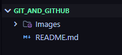
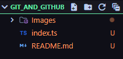
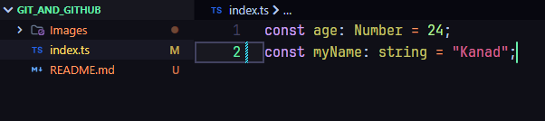
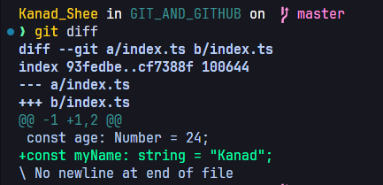
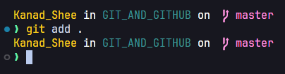
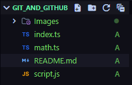

# GIT AND GITHUB:

---

## VCS: (Version Control System)

- Version Control, also known as source control, is tracking and managing software code changes.

- Famous VCS:
  - Git (most popular)
  - Apache SubVersion
  - Piper (used by Google)

---

## Installation:

- Download git and install in system:

```
https://git-scm.com/downloads
```

- Install it as other software are installed.

- Check if Git is intalled by:

```
git --version
```

---

## Cheat Sheet:

- Check out this handy cheat sheet from GitHub:
  - [Git Cheat Sheet](https://education.github.com/git-cheat-sheet-education.pdf)

---

## Setup Global Configuration:

- ### Why its needed?

  > Here we add our name and email as it will be easy for the maintainer of the codebase to see the changes in the codebase that who has made changes and by which email.

- To set display name:

```
git config --global user.name <your_name>
```

- To set display email:

```
git config --global user.email <mail_address>
```

- To check these:

```
git config --global user.name
```

and

```
git config --global user.email
```

---

## Initialization:

- Create a new folder and open in any IDE (ex: VS Code)

- Install some extension in VS Code for better clarity:

  - Git Graph

- Now, if we write any file or code or add some folders or something, Git is not going to track these changes.



- Now, to make sure that Git track these changes, we have to run one command:

```
git init
```

- This will create an empty repository in the current directory and will create **.git** folder which is a hidden folder. Here's how:


---

## Trackings:

- Here, we can see that now Git has started tracking our changes.

- And we can see there is a letter written beside the file **'U'**, which means untracked.

- Lets create a new file **index.ts** and do the same thing.

- 

- And now, we can run:

```
git add .\index.ts
```

- And we can see some changes:

- 


- Here, we can see the change from 'U' to 'A' which means added

- Now, if we again do some changes in the **index.ts** file, we can see:

- 

- Here, we can see the changes. The Git have track the modification of the chnages in the added file. We can see the change from 'A' to 'M' which means modified.

- And for Git Graph extension, we can see the green line also beside the line which has been added again.

- Now we can see the changes of the file by running a command:

```
git diff
```



- Here we can see that symbols **---** and **+++** symbols.

- +++ -> means added lines
- --- -> means removed lines

- Here no lines removed but one line added, so we can see a '+' symbol beside that.


- So, here we can see the changes in **git diff** command in terminal. One line removed and a function is added.

---

## Quite More:

- Now, if we create some more files, like:


- So, its very irritating to add more files by running git add <file name> and in real world coding there'll be a bunch of files.

- So, we can run one command:

```
git add .
```

- This command will add untracked files by running this single command.




- Here's how by running a single command, Git can start tracking all the files.

---

## Git Commits:

- After making a complete change, we commit that changes so that it becomes very easy for us in future that when and what changes are made and commited. Because a project will go on for a long time. So, its better to commit important changes in our project.

- Its basically to maintain a timeline for our project.

- With commit we also have to add an user friendly message.

