# GIT AND GITHUB:

---

## VCS: (Version Control System)

- Version Control, also known as source control, is tracking and managing software code changes.

- Famous VCS:
  - Git (most popular)
  - Apache SubVersion
  - Piper (used by Google)

---

## Installation:

- Download git and install in system:

```
https://git-scm.com/downloads
```

- Install it as other software are installed.

- Check if Git is intalled by:

```
git --version
```

---

## Cheat Sheet:

- Check out this handy cheat sheet from GitHub:
  - [Git Cheat Sheet](https://education.github.com/git-cheat-sheet-education.pdf)

---

## Setup Global Configuration:

- ### Why its needed?

  > Here we add our name and email as it will be easy for the maintainer of the codebase to see the changes in the codebase that who has made changes and by which email.

- To set display name:

```
git config --global user.name <your_name>
```

- To set display email:

```
git config --global user.email <mail_address>
```

- To check these:

```
git config --global user.name
```

and

```
git config --global user.email
```

---

## Initialization:

- Create a new folder and open in any IDE (ex: VS Code)

- Install some extension in VS Code for better clarity:

  - Git Graph

- Now, if we write any file or code or add some folders or something, Git is not going to track these changes.


- Now, to make sure that Git track these changes, we have to run one command:

```
git init
```

- This will create an empty repository in the current directory and will create **.git** folder which is a hidden folder. Here's how:


---

## Trackings:

- Here, we can see that now Git has started tracking our changes.

- And we can see there is a letter written beside the file **'U'**, which means untracked.

- Lets create a new file **index.ts** and do the same thing.

- 

- And now, we can run:

```
git add .\index.ts
```

- And we can see some changes:

- 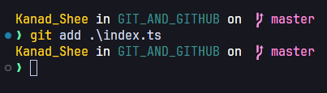


- Here, we can see the change from 'U' to 'A' which means added

- Now, if we again do some changes in the **index.ts** file, we can see:

- 

- Here, we can see the changes. The Git have track the modification of the chnages in the added file. We can see the change from 'A' to 'M' which means modified.

- And for Git Graph extension, we can see the green line also beside the line which has been added again.

- Now we can see the changes of the file by running a command:

```
git diff
```


- Here we can see that symbols **---** and **+++** symbols.

- +++ -> means added lines
- --- -> means removed lines

- Here no lines removed but one line added, so we can see a '+' symbol beside that.


- So, here we can see the changes in **git diff** command in terminal. One line removed and a function is added.

---

## Quite More:

- Now, if we create some more files, like:


- So, its very irritating to add more files by running git add <file name> and in real world coding there'll be a bunch of files.

- So, we can run one command:

```
git add .
```

- This command will add untracked files by running this single command.


- Here's how by running a single command, Git can start tracking all the files.

---

## Git Commits:

- After making a complete change, we commit that changes so that it becomes very easy for us in future that when and what changes are made and commited. Because a project will go on for a long time. So, its better to commit important changes in our project.

- Its basically to maintain a timeline for our project.

- With commit we also have to add an user friendly message.

- So, we can see some changes:


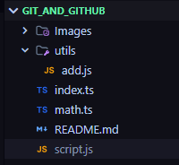

- Here, we can that till now whatever changes made have been commited and any time we can get back to it or can see when what file has been changed.

- We can track our commits and see commits history by running:

```
git log
```


- Here we can see:

  - Each commit has an id.
  - Has its author name.
  - Has its author email.
  - When the commit has been done.
  - The message with the commit.

- And to see the commits in single line or shortly, we can run:

```
git log --oneline
```


- So, we can see and unique part of the commit id with its message.

- Here's a track of commits:

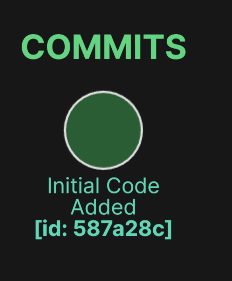

- Now, lets make some changes:

```ts
const myName1: string = "Kanad";

function sayName() {
  console.log(`My name is: `, myName1);
}

function isAbove18(age: number) {
  return age >= 18;
}
```

- Here some changes have done and new function isAbove18() is added.

- And by running command we can see the changes:

```
git diff .\index.ts
```


- Now, we have to run **"git add ."** and then **git commit -m "<message>"** to commit these changes.

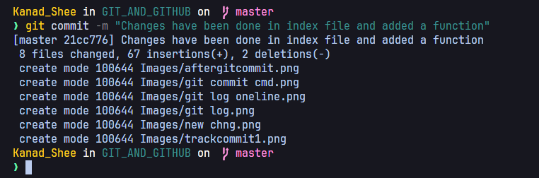

- Then, we can see the change by running **git log**


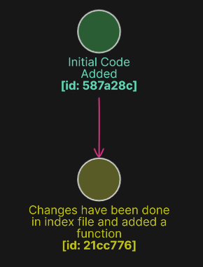

- > NOTE: We can notice a thing that head is pointing to the latest commit

- Using this commit id we can see what changes have been made:

```
git show <commit_id>
```

- This will show all the changes in that commit id

- One more command to checkout:

```
git blame <file_path>
```


- This command will show us changes in each line by which author and in which commit it has been changed.

- Lets remove the isAbove18 function and see:

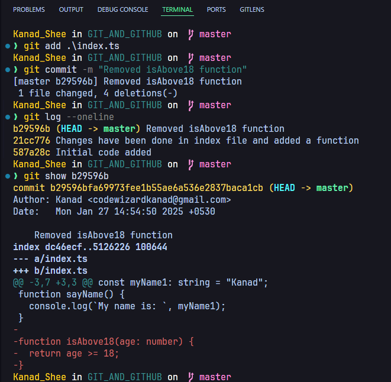

- Here we can see all these things in a single image
- Here one more commit has been done.

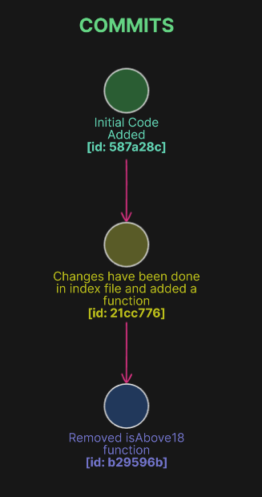

---

## Staging Area:

- Lets make some changes in our index.ts file and we can see status of changes by running:

```
git status
```

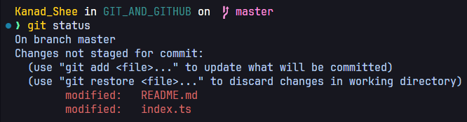

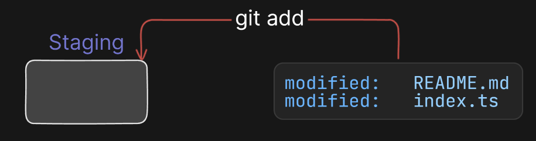
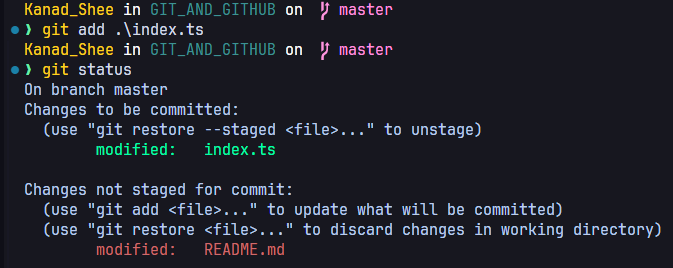

- Here, in green line we can see the changes in staging and in red line those are local changes.

- So, now in our staging area index.ts file will come.

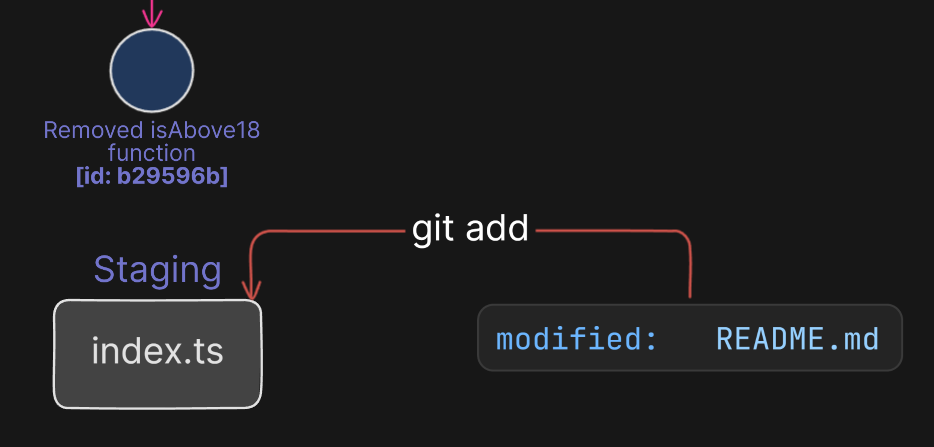

- Now if we see:
  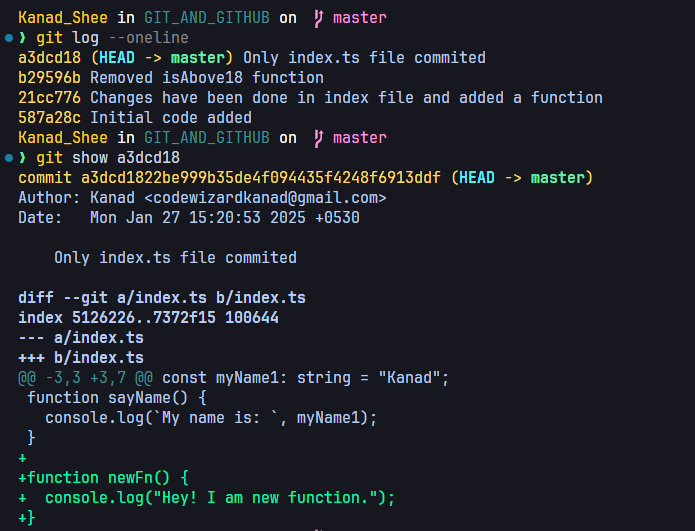

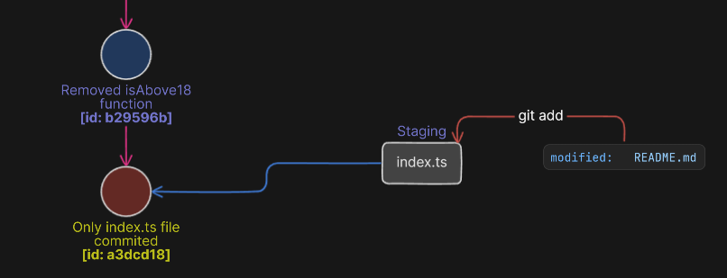
